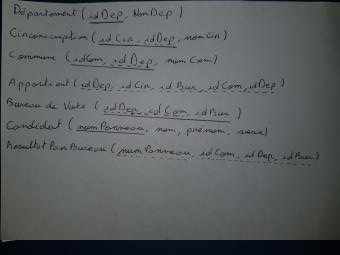
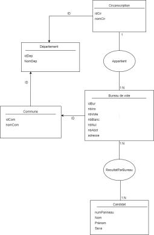

## Première partie

* Importation des données (exportation CSV depuis [la page WEB](https://public.opendatasoft.com/explore/dataset/election-presidentielle-2017-resultats-par-bureaux-de-vote-tour-1/table/?disjunctive.libelle_de_la_commune), uniquement les données du Rhône et de la Loire) sous PostgreSQL dans une relation unique nommée « election-csv » (créée par le script fourni plus loin).
* Étude des données. Dans un fichier texte, pour chaque colonne, décrivez la signification de l'attribut, son rôle dans les données, éventuellement la façon dont il est construit.
* Dressez un schéma Entité-Association modélisant les données. Vos choix seront justifiés en indiquant les DF impliquées par votre schéma, dont vous aurez vérifié la satisfaction dans les données (voir requête plus loin).
* Traduisez en relationnel.
* Implémentez la base de données correspondante, avec les contraintes appropriées. Migrez les données par des requêtes SQL qui seront proprement conservées dans la documentation de la migration.
* Faites une procédure "best_par_candidat" qui prend en entrée l'identifiant d'un candidat et affiche proprement la liste des 10 communes de plus de 3000 votants où le candidat a fait ses meilleurs scores en pourcentage (dans l'ordre inverse du score). Affichez à chaque fois le pourcentage réalisé, et le rang du candidat dans cette commune. En cas d'égalité entre deux communes pour ce candidat, celle avec le plus grand nombre de votants passe avant.

## Schéma relationnel

##Schéma Entité-Association

## Dépendances fonctionnelles

- idDep --> nomDep
- idDep,idCom --> nomCom
- idDep,idCir --> nomCir
- idDep,idCom,idBur --> nbIns, nbVote, nbAbst, nbBlanc, nbNul, adresse
- numPanneau --> Nom, Prénom, Sexe

## Tester la satisfaction d'une DF

- select distinct X , Y 
	- from r
	- where X in (select X
			- from r
			- group by X 
			- having count(distinct Y)>1 )
- order by X, Y ;
