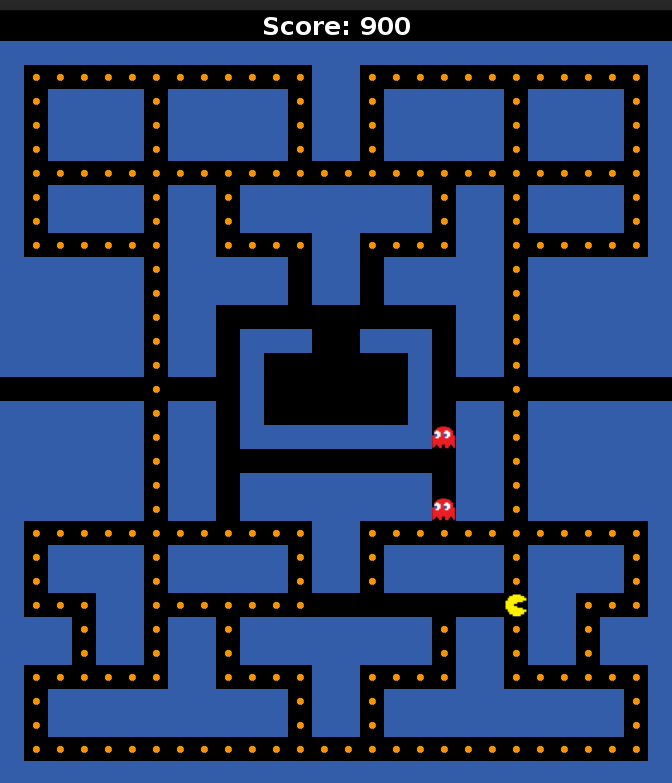

## Pacman

A basic Pacman implementation in Java (using Swing) with old school graphics, by Kennedy Niamke and Antoine Poinsot.




### How to build

#### Dependencies

This was developed against the JDK 11.

#### Actual build

I know it's not standard in Java world but I created a Makefile, because Makefile are
short, straightforward, and efficient for small projects. In short Makefile are [cool](https://xkcd.com/801/).

Build the java files in current directory with:
```
make build
```
Build and run with:
```
make
```
Create the jar archive (one is already present in bin/, though) with:
```
make jar
```


### Features

#### Model side

- Original Pacman maze
    - a bitmap for the grid which allows a simple collision management.
    - a spawn spot for the ghosts (without the lock, though).
- Multiple ghosts.
- Smart ghost moves (randomized Lee algorithm to find the shortest path to Pacman,
    refreshed every 5 ticks on average).
- Scoring (+10 for eating a dot).
- Cached directions for Pacman (a direction leading to a wall will be cached until Pacman
    can actually go toward that direction).
    - This avoids to be able to easily stop Pacman.
- Smoothed sleep duration in main loop (if the updates took time, randomly the Lee
    algorithm which is basically O(N^2) with a big recursion lol, we'll sleep less).
- Pacman "teleportation" between the left and right side of the map.

#### View side

- Original pixelised graphics (I prefer them, and since the Swing rendering is laggy it
    simulates an old school gameplay ^^).
- Rotatable images (Pacman image will rotate toward the right direction).
- "Game over" and "You won!" screens.

#### Controller side

- You can restart the game once it ended (but it's laggy, see issue #1) by pressing
    <space>.
- The updates are event-based (this avoids a big nested for-loop to update the view grid
    accordingly to the model grid).
    - Note that they use the JDK `PropertyChangedEvent` pattern instead of the deprecated
        and suboptimal `Observable` pattern.
- There is an easter egg, because both at the day I write this README it's easter, and I
    think the reviewers wont be able to beat the Lee algorithm :-P.
