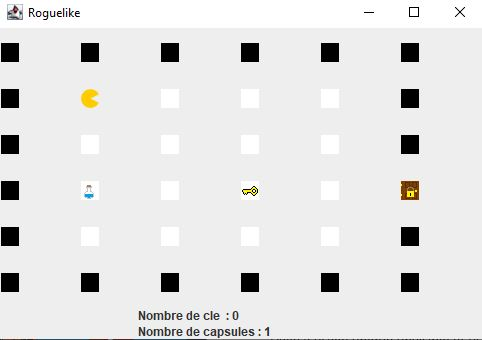
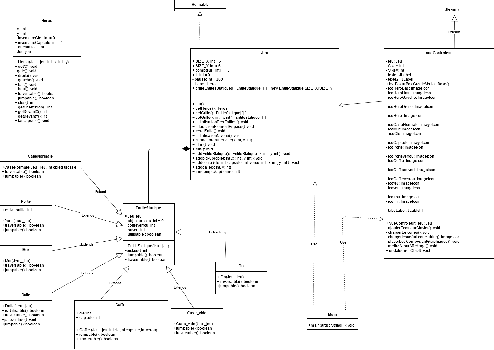

  # 					RogueLike
 

Rogue est un jeu d’enigmes dans lequel vous controlez Le bonhomme qui tente de s'echapper d’un labyrintheen 2D vue du dessus.  Ce labyrinthe est composé de salles reliées entre elles par des portes. Pour s’enfuir Le bonhomme doit parvenir à trouver la salle finale.  Chaque salle est composée d’un certain nombre de dalles. Certaines de ces dalles sont à usage unique, Le bonhomme ne peut les traverser qu’une seule fois, après quoi elles s’enflamment et deviennent inutilisables.  Cependant, dans chaque salle Le bonhomme peut utiliserun certain nombre de capsules contenant de l’eau capable de rendre ces dalles traversables une nouvelle fois en éteignant le feu ;  une capsule permet d’eteindre une seule dalle enflammée.  Il dispose d’une quantité limitée de capsules par salle, il lui faut donc utiliser ces capsules avec parcimonie et de fa ̧con réfléchie. Les portes qui relient les salles peuvent être verrouillées.  Dans ce cas-là, Le bonhomme doit trouver des clés dans  les  salles,  afin  de  déverrouiller  les  portes.   Ces  clés  peuvent  se  trouver  à  même  le  sol,  ou etre contenues dans descoffres.

## Auteurs 
  *NIAMKE* Ange-Kennedy **11715528** 
  *Drevet* Quentin **11709541**

### Pré-Requis
* la bibliothèque JDK 11

#### Choix de conception

Nous avons choisi lors de l’ouverture des coffres, que les pickups iront directement dans l’inventaire du héros contrairement a les faire apparaître au sol pour une raison : si le nombre de pickup dépasse le nombre de case disponible est inférieur au nombre de pickup cela poserai plus de problème.
Pour l’inventaire, les coffres verrouillés, les coffres verrouillés et l’orientation nous avons décidé de ne pas créer de nouvelle classe, car cela ne nécessitait que peu d’ajout en les insérant dans d’autre classe.
Pour les dalles à usage unique, nous avons par contre décidé de créer une nouvelle classe car nous avions peur de surcharger les case normale.
Pour la recharge de capsule, nous avons fait en sorte que lorsque le joueur est sur une porte cela ramène son compte de capsule à 1.

### Fonctionnalité 
* Change de salle, scrolling (extension), cela nous pris environ 2 jours
* Saut cela nous pris environ une journée.
* Orientation du joueur avec les touches dans la direction souhaitée cela nous pris environ 3 jours, car nous avions du mal avec la rotation dans un premier temps, puis nous avons décidé de faire simple en changement juste les images.
* Différents types de case (coffre, clé, capsule), cela nous pris environ 2 jours.
* Inventaire (incrémentation), cela nous pris environ un jour.
* Interaction avec les pickups et dalle, cela nous pris environ 2 jours.
* Dalle à usage unique (invisible et usage après le passage du joueur), cela nous pris environ 1 jour.
* Génération aléatoire des salles et des pickups, cela nous pris environ 1 jours.
* Case vide, impossibilité d’aller sur le trou, cela nous pris environ une journée.
* Utilisation de capsule pour éteindre les flammes, cela nous pris environ une journée.
* Réinitialisation de l’inventaire à chaque interaction avec une porte (lorsque le joueur est sur la porte), cela nous pris environ une journée.

#### Diagramme de Classe

